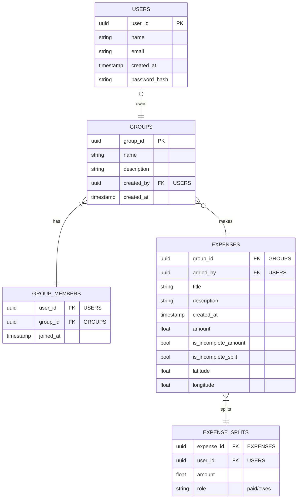

# DBMS Project: Finance Sharing Application

## Project Selection and Ideation

> Splitwise but FOSS
>
> Current splitwise application is riddled with ads and is not open source.

### Basic Idea

* Add accounts of users to share a particular set of expense
* Allow user accounts so that users can add expenses to their accounts
* Split an expense among users

### Feature set

1. No ads
2. FOSS with GPL v3 license
3. User accounts with email/password authentication
4. Addition of users to share expenses
5. Expenses can be added by other users with permission management.
Not only the owner of the expense can edit/delete it,
but others can also.
6. Expenses addition request can be sent to the owner of the group.
7. Uneven split of expenses among users
8. Final settlement of expenses
9. SQL database.
10. Ability to use local DB (SQLite) for shared expenses to keep application fully offline
11. Export data in various output formats (XML, JSON, CSV)
12. Optional: E2E encryption of expenses (with shared groups encryption)
13. Restrictive database access for end users

### Shared Expenses

* Create a group of users to share expenses
* New expenses are added to the group
* Uneven split of expenses among users
* Flags to denote that an entry hasn't been populated correctly/yet.
* Expense filtering
<!-- * Private expense (should be allowed) to  -->
* Permission management
  * Allow only owners to add, allow everyone to add, allow only owners to delete others expense, allow others to delete others expenses, edit permission, view permission, log permission, arbitrary expense addition/expense addition request.
  * Option to enable/disable permission management.
* Expense edit history required to make sure bad-actors do not edit an expense.
* Cloud based storage for sharing
* Final expense tally to show who owes how much.
  * Transaction logs for each user to show what a user has spent.

#### Workflow

1. Add a group with details
2. Invite users to the groups by selecting contacts/email/name
    * Online:
        1. Other users are added
    * Offline:
        1. Local SQLite databae/table is created
        2. Users can be added but locally
3. User 1 adds an expense:
    1. User selects contributor(s), contribution per user and which user(s) the expense has been done
        * Expense split can be set by amount/by percentage.
        * Autofilling the remaining amount possible
        * Equal split possible (quick toggle/button)
        * Flag an entry (lenders/borrowers) to note that the entry is not completed yet, and has to be filled in later.
    2. Data saved along with who added the expense
    3. Addition of images, location, description, date, time, type of expense (customizable)
        * Add option to set public/private mode. If an expense is private, the logs/transaction history is only visible to the lenders and borrowers.
4. View the total owed amount by each of them
5. Allow filtering expenses based on parties owed, parties lent, parties involved, date range, amount greater than, amount lesser than, amount in range.

### Private expenses for others

* Individual expenses can be added for other users
* It needs to be split unevenly among users
* Total can be tallied up on demand
* Markers are required to show which expenses are settled and which are not
* Logs need to be accessed to show who spend what
* Expenses need to be settled by others
* It is not shared

#### Workflow

1. User creates a spending entry
    * Provide amount spent, spent to which user(s) and lent amount per borrower
    * Add description, date, time, type of expense (customizable), location, images
2. Show amount lent on demand
    * Split the amount into amount lent per user
    * Show logs for each user spending

### Language choice

* Frontend (devices): Dart programming language with Flutter UI Framework
* Backend (to be run in servers and locally): Go

### Building workflow

#### Frontend

[ ] Create sample static data for user, groups, transaction list for a group

[ ] Visualize user info

[ ] Visualize group info

[ ] Visualize an expense

[ ] Create a new user

[ ] Create a new split group

[ ] Create a new expense

#### Backend

[ ] Send user info

[ ] Send group info

[ ] Send an expense info

[ ] Handle new group creation

[ ] Handle new expense addition

[ ] Handle new user creation

#### Database

[ ] Fetch expense details

[ ] Fetch group details

[ ] Fetch user details

[ ] New expense split creation

[ ] New group creation

[ ] New user creation

## Conversion of Project Idea to ER Diagram

<!-- TODO: add er diagram -->

## Conversion of ER diagram to UML Class Diagram



## Conversion of UML Diagram to Database

Creation of database in MySQL:

```sql
CREATE TABLE USERS (
    user_id VARCHAR(36) PRIMARY KEY,
    name VARCHAR(255) NOT NULL,
    email VARCHAR(255) UNIQUE NOT NULL,
    password_hash VARCHAR(255) NOT NULL,
    created_at TIMESTAMP NOT NULL DEFAULT CURRENT_TIMESTAMP
);

CREATE TABLE GROUPS (
    group_id VARCHAR(36) PRIMARY KEY,
    name VARCHAR(255) NOT NULL,
    description TEXT,
    created_by VARCHAR(36) NOT NULL,
    created_at TIMESTAMP NOT NULL DEFAULT CURRENT_TIMESTAMP,
    FOREIGN KEY(created_by) REFERENCES USERS(user_id) ON DELETE SET NULL
);

CREATE TABLE GROUP_MEMBERS (
    user_id VARCHAR(36) NOT NULL,
    group_id VARCHAR(36) NOT NULL,
    joined_at TIMESTAMP NOT NULL DEFAULT CURRENT_TIMESTAMP,
    PRIMARY KEY (user_id, group_id),
    FOREIGN KEY(user_id) REFERENCES USERS(user_id) ON DELETE CASCADE,
    FOREIGN KEY(group_id) REFERENCES GROUPS(group_id) ON DELETE CASCADE
);

CREATE TABLE EXPENSES (
    expense_id VARCHAR(36) PRIMARY KEY,
    group_id VARCHAR(36) NOT NULL,
    added_by VARCHAR(36) NOT NULL,
    title VARCHAR(255) NOT NULL,
    description TEXT,
    amount DECIMAL(10, 2) NOT NULL,
    created_at TIMESTAMP NOT NULL DEFAULT CURRENT_TIMESTAMP,
    is_incomplete_amount BOOLEAN NOT NULL DEFAULT 0,
    is_incomplete_split BOOLEAN NOT NULL DEFAULT 0,
    latitude DECIMAL(9, 6),
    longitude DECIMAL(9, 6),
    FOREIGN KEY(group_id) REFERENCES GROUPS(group_id) ON DELETE CASCADE,
    FOREIGN KEY(added_by) REFERENCES USERS(user_id) ON DELETE SET NULL
);

CREATE TABLE EXPENSE_SPLITS (
    expense_id VARCHAR(36) NOT NULL,
    user_id VARCHAR(36) NOT NULL,
    role VARCHAR(10) NOT NULL,
    amount DECIMAL(10, 2) NOT NULL,
    PRIMARY KEY (expense_id, user_id, role),
    FOREIGN KEY(expense_id) REFERENCES EXPENSES(expense_id) ON DELETE CASCADE,
    FOREIGN KEY(user_id) REFERENCES USERS(user_id) ON DELETE CASCADE,
    CONSTRAINT chk_role CHECK (role IN ('paid', 'owes'))
);
```
